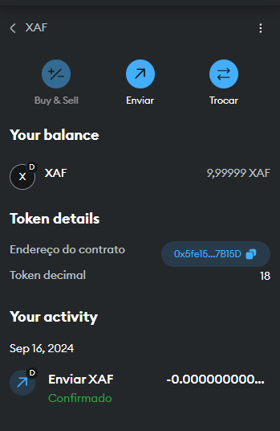
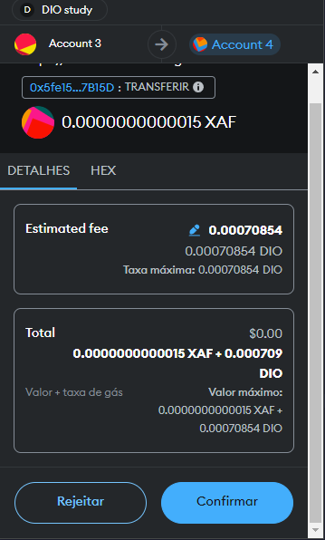

## XafiToken: An ERC-20 Token Implementation

**Summary:**

This Solidity code defines a custom ERC-20 token called `XafiToken`. It provides standard ERC-20 functionalities such as:

* **Total Supply:** Returns the total number of tokens in circulation.
* **Balance:** Retrieves the balance of a specific address.
* **Transfer:** Allows users to transfer tokens between addresses.
* **Approval:** Grants permission to a spender to use the owner's tokens.
* **Transfer From:** Enables a spender to transfer tokens on behalf of the owner.

**Token Details:**

* **Name:** Xafi Token
* **Symbol:** XAF
* **Decimals:** 18

**Implementation:**

1. **Inherits from `IERC20`:** The contract extends the `IERC20` interface, which defines the core functions and events for ERC-20 tokens.
2. **State Variables:**
   * `balances`: Maps addresses to their corresponding token balances.
   * `allowed`: Stores approved allowances for spenders.
   * `totalSupply_`: Represents the total supply of tokens.
3. **Constructor:** Initializes the total supply and assigns it to the creator's address.
4. **Functions:**
   * **`totalSupply()`:** Returns the total supply of tokens.
   * **`balanceOf(address)`:** Retrieves the balance of a specific address.
   * **`transfer(address, uint256)`:** Transfers tokens from the sender to a recipient.
   * **`approve(address, uint256)`:** Grants permission to a spender to use the owner's tokens.
   * **`allowance(address, address)`:** Returns the approved allowance for a spender.
   * **`transferFrom(address, address, uint256)`:** Transfers tokens from one address to another using an approved allowance.

**Key Points:**

* Adheres to the ERC-20 standard for compatibility with other ERC-20-compliant contracts and wallets.
* Provides a foundation for building various token-based applications.
* Can be customized by modifying the total supply, decimals, and other parameters.

**Additional Notes:**

* Consider adding additional features such as token burning, minting, or pausing to enhance functionality.
* Implement security best practices to protect against vulnerabilities.
* Test the contract thoroughly to ensure correct behavior and prevent errors.
* The code is working with Remix + Metamask.

